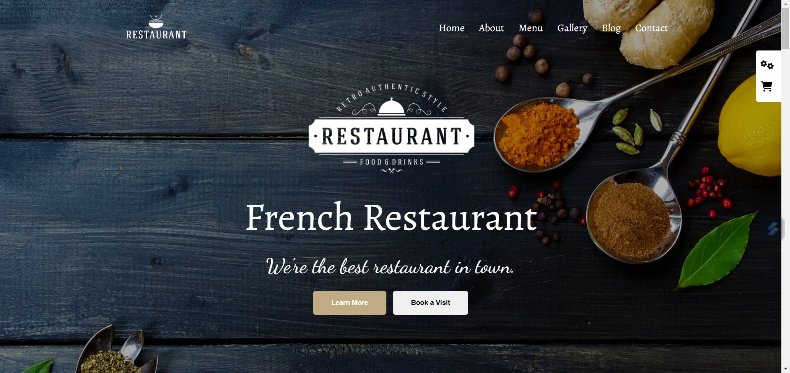
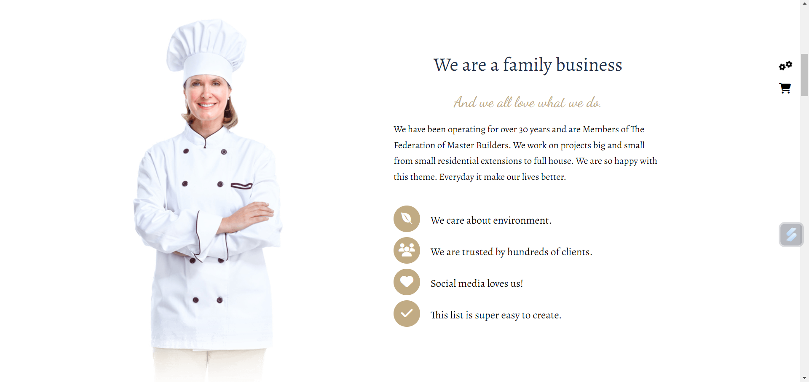
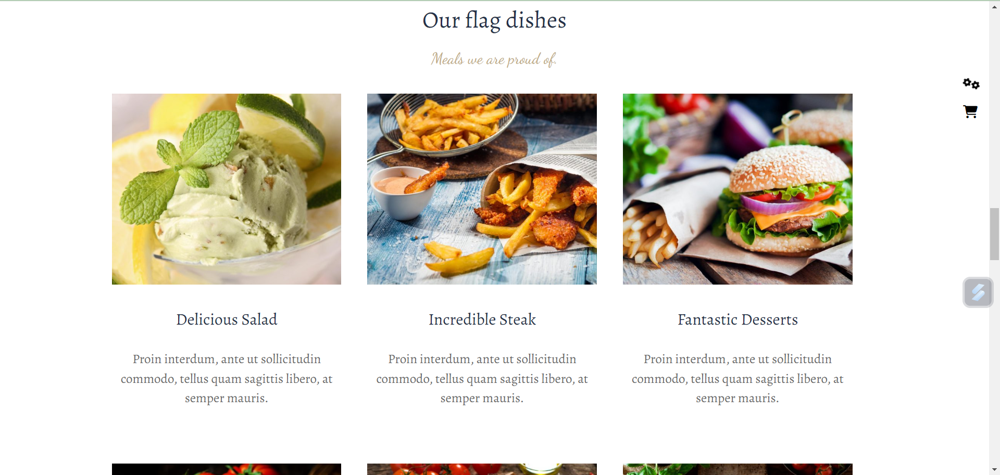

# Getting Started with Create restaurant website

This restaurant project is a responsive front-end web application built using HTML, CSS, and Bootstrap. It showcases my skills and projects, featuring a clean, modern design. Bootstrap ensures responsive layouts, while custom CSS enhances the look for an engaging user experience

# Link URL project
https://yazandoha.github.io/Resturent2.0/

# About project
in this project i use :
- HTML
- CSS
- JS
- Bootstrap

